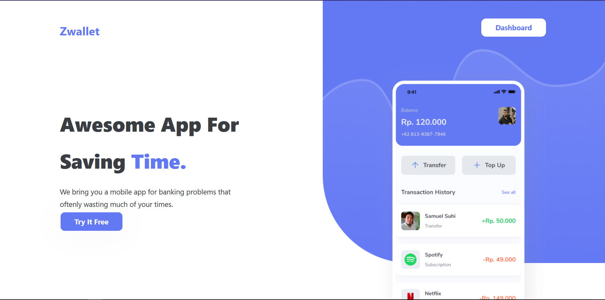
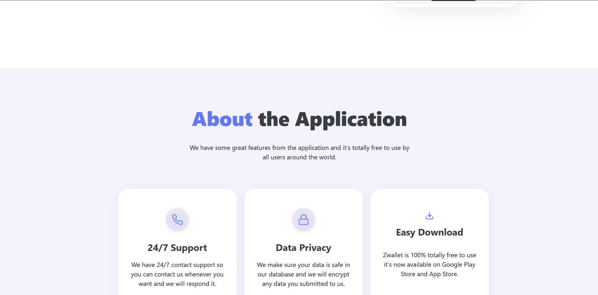
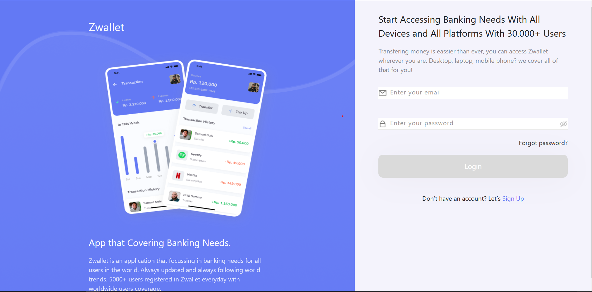
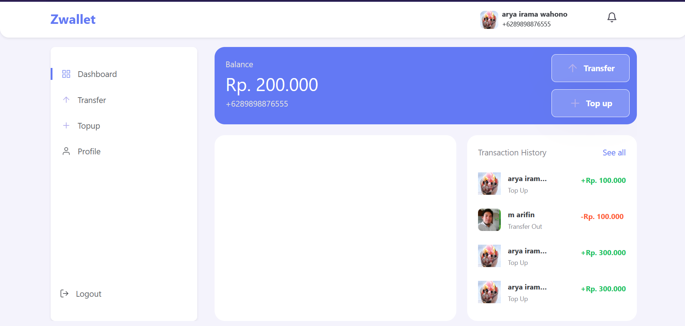

# zWallet Payment Application

This application is an application built using react js, and various other tools. This application is used for various online payment media, with an online wallet system..

### `Tools`
1. axios
2. bootrap
3. classnames
4. query string
5. rc-pagination
6. redux
7. redux persist
8. redux thunk
9. simple react validator
10. sweet alert
11. web vitals

### `Application Preview`
1. Landing Page

 
2. Auth

 
3. Dashboard Admin, User
  

