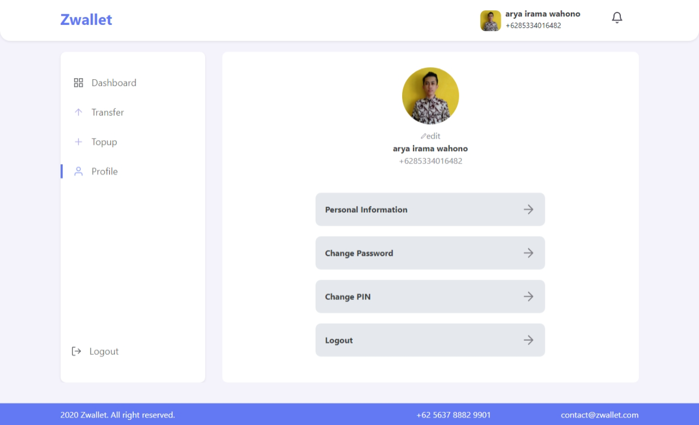
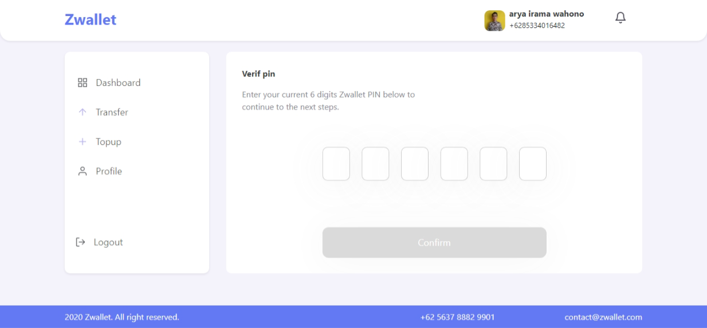

<br />
<p align="center">
<div align="center">
  
</div>
  <h3 align="center">ZWALLET</h3>
  <p align="center">
    <a href="https://github.com/aryairama/zwallet-react"><strong>Explore the docs »</strong></a>
    <br />
    <a href="https://bit.ly/_zwallet">View Demo</a>
    ·
    <a href="https://github.com/aryairama/zwallet-react/issues">Report Bug</a>
    ·
    <a href="https://github.com/aryairama/zwallet-react/pulls">Request Feature</a>
  </p>
</p>


<!-- TABLE OF CONTENTS -->
## Table of Contents

- [Table of Contents](#table-of-contents)
- [About The Project](#about-the-project)
  - [Built With](#built-with)
- [Getting Started](#getting-started)
  - [Prerequisites](#prerequisites)
  - [Installation](#installation)
  - [Setup .env](#setup-env)
- [Screenshots](#screenshots)
- [Contributing](#contributing)
- [Related Project](#related-project)
- [Our Team](#our-team)


<!-- ABOUT THE PROJECT -->
## About The Project

This application is an application built using react js, and various other tools. This application is used for various online payment media, with an online wallet system..


### Built With

- [Redux](https://redux.js.org/)
- [React JS](https://reactjs.org/)
- and other


<!-- GETTING STARTED -->
## Getting Started

### Prerequisites

This is an example of how to list things you need to use the software and how to install them.

* [nodejs](https://nodejs.org/en/download/)

### Installation

- Clone This Front End Repo
```
git clone https://github.com/aryairama/zwallet-react.git
```
- Go To Folder Repo
```
cd telegram-next-js
```
- Install Module
```
npm install
```
- Type ` npm run dev` To Start Website
- Type ` npm run production` To Start Production

### Setup .env
Create .env file in your root project folder.
```
REACT_APP_API_URL=[BACKEND_URL]
REACT_APP_MIDTRANS_BRI = true
REACT_APP_MIDTRANS_BCA = true
REACT_APP_MIDTRANS_BNI = true
REACT_APP_MIDTRANS_PERMATA = true
REACT_APP_MIDTRANS_MANDIRI = true
```

<!-- ROADMAP -->
## Screenshots

<div align="center">
  
  
   
  
  
   
  
  
  
  
  
  
</div>

<!-- CONTRIBUTING -->
## Contributing

Contributions are what make the open source community such an amazing place to be learn, inspire, and create. Any contributions you make are **greatly appreciated**.

1. Fork the Project
2. Create your Feature Branch (`git checkout -b feature/AmazingFeature`)
3. Commit your Changes (`git commit -m 'Add some AmazingFeature'`)
4. Push to the Branch (`git push origin feature/AmazingFeature`)
5. Open a Pull Request


## Related Project
:rocket: [`Backend Zwallet Clone`](https://github.com/aryairama/zwallet-express)

:rocket: [`Frontend Zwallet Clone`](https://github.com/aryairama/zwallet-react)

:rocket: [`Demo Zwallet Clone`](https://bit.ly/_zwallet)

<!-- CONTACT -->
## Our Team

<center>
  <table>
    <tr>
      <td align="center">
        <a href="https://github.com/aryairama%22%3E">
          <br/>
          <sub><b>Arya Irama Wahono</b></sub> <br/>
          <sub>Leader | Full Stack Web Developer</sub>
        </a>
      </td>
      <td align="center">
        <a href="https://github.com/Chandra-Kurnia%22%3E">
          <br/>
          <sub><b>Chandra Kurniawan</b></sub> <br/>
          <sub>Back End Web Developer</sub>
        </a>
      </td>
      <td align="center">
        <a href="https://github.com/MochamadRicoPratamaPutra">
          <br/>
          <sub><b>Mochamad Rico Pratama Putra</b></sub> <br/>
          <sub>Front End Web Developer</sub>
        </a>
      </td>
      <td align="center">
        <a href="https://github.com/emhaarifin">
          <br/>
          <sub><b>Muhammad Arifin</b></sub> <br/>
          <sub>Front End Web Developer</sub>
        </a>
      </td>
    </tr>
  </table>
</center>
